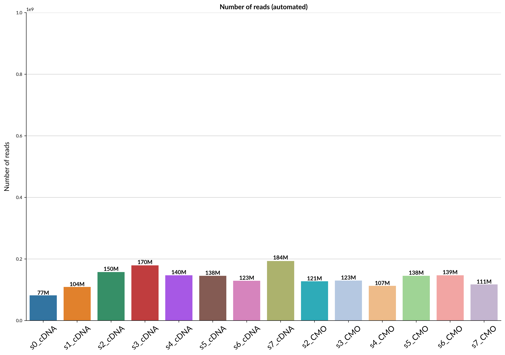
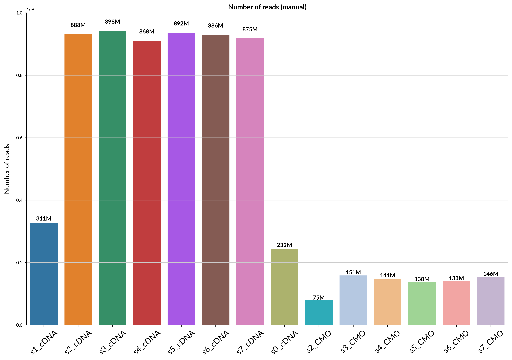
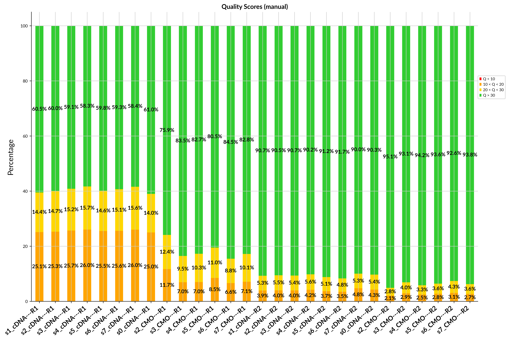
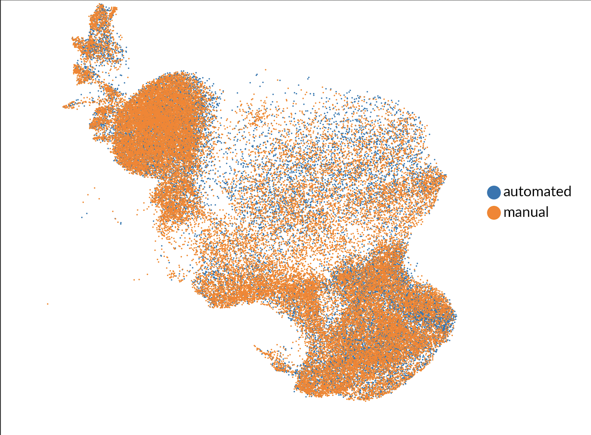

# OT-2 10x scRNA seq library prep (with multiplexing!)

---
- This protocol is difficult to get working properly
- The OT-2 & related consumables have issues making this especially difficult
- Please contact Ben at ben@retro.bio before attempting this for yourself
---

Manual single cell library preps are tedious and error-prone. Automated solutions cost >$260k. This repo contains all code & hardware required to automate 10x Genomics library preps on Opentrons for $26k.

	

Table of Contents
=================
* [Protocol](#protocol)
* [Results](#results)
* [Required modifications](#required-modifications)
* [Modules](#modules)
* [Labware](#labware)
* [Pipettes](#pipettes)
* [Reagents](#reagents)
* [Optional](#optional)
* [Deck Setup](#deck-setup)
* [Economic Efficiency](#economic-efficiency)
* [Library prep quality](#library-prep-quality)

## Protocol
Prepping 8 libraries involves ~2 hours of human labor[^1]. 

Step 1: GEM Generation & Barcoding
- Perform manually using [chromium controller](https://www.10xgenomics.com/instruments/chromium-controller)
- Prepare reagents, plates, and labware in Opentrons

Step 2:  (1:30)
- Pipette GEMs into PCR plate, add pink separation agent, wait 2 minutes, remove separation agent
- Begin automated portion
- Return within 24 hours to begin Step 3

Step 3: (4:30-5:00)
- Quantify DNA [^2]
	- update thermo-cycles-3.5.json with appropriate PCR cycle count
- If multiplexing:
	- reload pipette tips
- Begin automated portion
- Return within 24 hours and retrieve prepared sample (held at 4C indefinitely)
- Submit sample for sequencing!

## Results

To showcase the performance of the automated protocol we generated multiple QC plots.

### Number of reads

Automated             |  Manual
:-------------------------:|:-------------------------:
  |  

### Quality scores

Automated             |  Manual
:-------------------------:|:-------------------------:
  |  

### scVI integration

[scVI](https://www.nature.com/articles/s41592-018-0229-2) is the de-facto [standard method](https://docs.scvi-tools.org/en/stable/tutorials/notebooks/api_overview.html) for correcting technical batch effects in single-cell data. Here, we applied it using manual/automated as our batch variables and plotted the resulting integration. If nothing but technical noise distinguishes our two samples, we expect to see perfect overlap.

## Required modifications
- [Opentrons Superior Magnet Module](https://github.com/retrobiosciences/opentrons-superior-magnet)

## Modules
- Thermocycler Module
- Magnetic Module
- Temperature Module

## Labware
- 96-well aluminum block
- Bio-Rad Hard-Shell 96-Well PCR Plate, high profile, semi skirted #HSS9601 (2x)
- NEST 0.1ul PCR plate full-skirt
- Opentrons 300ul Tips (4-6x)
- Opentrons 20ul Tips (2-3x)
- 12-well reagent trough

## Pipettes
- P300 8-channel
- P20 8-channel

## Reagents
- [10x 3' medium throughput v3.1](https://www.10xgenomics.com/support/single-cell-gene-expression/documentation/steps/library-prep/chromium-next-gem-single-cell-3-v-3-1-dual-index-libraries)

## Optional
- [Pipette cam](https://github.com/retrobiosciences/opentrons-pipette-cam) (log liquid transfer errors!)[^3]

## Deck Setup
opentrons | deck | setup
--- | --- | ---
10: thermocycler| 11: P300 tips| trash
7: thermocycler| 8: P300 tips | 9: P20 tips
4: mag module | 5: P300 tips | 6: P20 tips
1: temp module | 2: P300 tips | 3: 12-well trough

## Economic Efficiency
platform | hardware cost | servicing contract | throughput 
--- | --- | --- | ---
10x Chromium Connect | $260k | yes | 24-samples/day
Opentrons| $26k | no | 32-samples/day

[^1]: Running 8 robots for a year, a company can reasonably expect to spend $70 million in reagents and sequence 300M-1.4B single cells.
[^2]: Skipping quantification step for samples with consistent cDNA recovery allows completion of step 2 & 3 uninterrupted. Works great most of the time! Multiplexing always requires P300 tip reload. Tip usage can be further optimized 
[^3]: I want to control the pipette with camera input. So much closed-loop precision at our fingertips!

